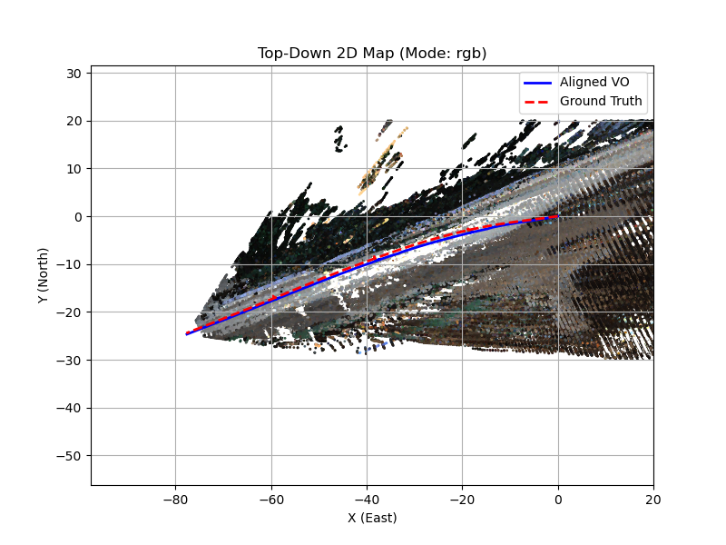

# LLV-SLAM: Multi-Sensor SLAM with Low-Cost LiDAR and Visual Fusion

**Phurithat Tangsripairoje, Meng Wu, Yikuan Xiong**  
*University of Michigan – EECS 568 / ROB 530: Mobile Robotics*

This repository presents **LLV-SLAM**, a lightweight SLAM framework that fuses low-cost sparse LiDAR and RGB camera images through an adaptive depth refinement pipeline. The system enhances stereo-based visual odometry and mapping performance by leveraging geometric priors from LiDAR and texture-rich cues from vision—enabling improved robustness under challenging lighting and texture conditions.

## 🔍 Key Features

- **Multi-Modal Depth Estimation**: Combines stereo matching and LiDAR-guided refinement.
- **Pose Tracking with Sensor Fusion**: Uses vision-based VO enhanced by LiDAR information.
- **Feature Extraction & Matching**: Configurable detectors (ORB, SIFT, AKAZE) and matchers (BF, FLANN).
- **Pose Graph Optimization**: Loop closures + GTSAM-based optimization.
- **Dense 3D Mapping**: Point cloud generation using optimized poses.

## 📊 SLAM Pipeline Flow

```text
KITTI Input Sequences
 └──> image_loader.py         (Stereo Images, Depth Computation)
 └──> calibration.py          (Stereo Calibration)
 └──> sensor_fusion.py        (LiDAR + Depth Refinement)

 └──> feature_matcher.py      (ORB/SIFT/AKAZE + BF/FLANN Matchers)
 └──> pose_estimation.py      (Visual Odometry via PnP + RANSAC)
 └──> loop_closure.py         (Descriptor Matching + PnP,  Loop Constraints)
 └──> pose_graph.py           (Pose Graph Opt: GTSAM)

 └──> mapping.py              (Back-projection + Point Cloud Gen)
 └──> mapping_utils.py        (Voxel filtering, RGB mapping)
 └──> plot_utils.py           (2D/3D visualization)
 └──> ground_truth.py         (Groundtruth data extraction from oxts)
```

## ⚙️ How to Use

### Prerequisites

- OS: Ubuntu 22.04
- Python: 3.10+

Install dependencies:

```bash
pip install -r requirements.txt
```

### Dataset

1. Download KITTI sequences (e.g., `2011_09_26_drive_0002_sync`) and calibration files.
2. Link dataset paths in `settings.txt`.

### Run the Pipeline

```bash
python3 main.py
```

Customize options like feature extractors, matchers, visualization mode (`2d`, `3d`) in `settings.txt`.

## ✅ Expected Output

- Top-down or 3D map of environment
- Trajectories: Estimated vs Ground Truth
- ATE RMSE evaluation (see `plot_utils.py`)
- Example:
  

## 🌐 Resources

- [KITTI Raw Dataset - City Driving](https://www.cvlibs.net/datasets/kitti/raw_data.php?type=city)
- [GTSAM (Georgia Tech Smoothing and Mapping Library)](https://gtsam.org/)
- [Open3D Library](http://www.open3d.org/)

---
